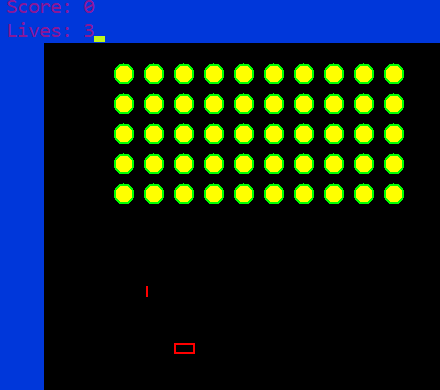
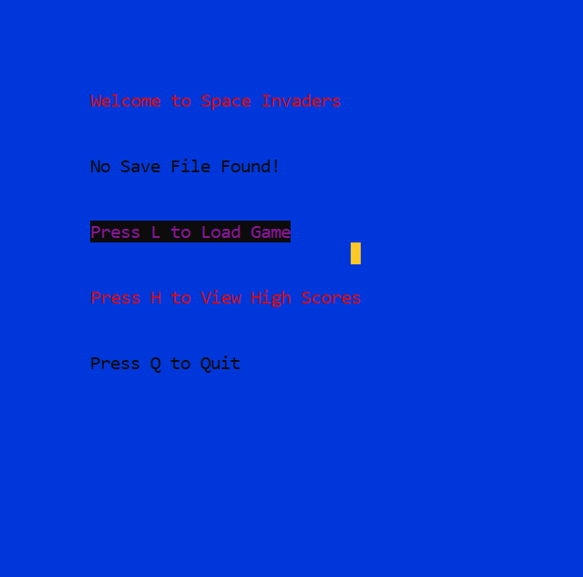

# 🚀 Space Invaders (C++)

A retro-inspired **Space Invaders** game developed in **C++** for Windows using a custom graphics library (`help.h`) based on Windows GDI. The project recreates the classic arcade gameplay with real-time movement, collision detection, score tracking, and persistent game progress.

> Developed as part of a university programming project.

## 📸 Screenshots

### Main Menu


### Gameplay


### Load Screen


## ✨ Features

* 👾 5 × 10 alien formation with side-to-side movement
* 🚀 Player movement in four directions
* 🔫 Bullet shooting mechanics
* 💥 Collision detection between bullets and aliens
* 🎯 Random enemy bullet firing
* ❤️ Player lives and score tracking
* 🏆 Persistent Top 5 high-score leaderboard
* 💾 Save and load game progress
* ⏸ Pause and resume functionality
* 🏁 Win and Game Over screens

## 🛠 Technologies Used

* C++
* Windows API (GDI)
* Custom Graphics Library (`help.h`)
* File Handling

## 📂 Project Structure

```text
main.cpp          # Main game logic
help.h            # Graphics and input helper functions
game_save.txt     # Saved game state (generated automatically)
highScore.txt     # High-score records (generated automatically)
```

## 🎮 Controls

| Key        | Action              |
| ---------- | ------------------- |
| Arrow Keys | Move player         |
| Space      | Fire bullet         |
| P          | Pause / Resume      |
| S          | Start New Game      |
| L          | Load Saved Game     |
| H          | View High Scores    |
| Q          | Quit                |
| Enter      | Return to Main Menu |

## 🚀 How to Run

1. Clone the repository.
2. Open the project in a Windows-compatible C++ IDE (Visual Studio, Code::Blocks, or MinGW).
3. Build the project.
4. Run the executable.

### MSVC

```bash
cl /EHsc main.cpp
```

### MinGW

```bash
g++ main.cpp -o SpaceInvaders.exe -lgdi32
```

## 📚 Learning Outcomes

* Real-time game loop implementation
* Collision detection
* Keyboard event handling
* File handling for save/load functionality
* High-score management
* Windows GDI graphics programming

## 🔮 Future Improvements

* Sound effects and background music
* Multiple difficulty levels
* Animated sprites
* Power-ups
* Improved rendering using double buffering

## 👩‍💻 Author

**Fatima Tahir**
BS Computer Science
FAST NUCES Lahore
